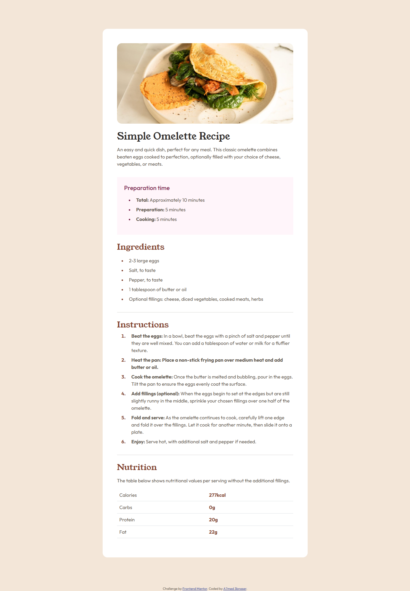

# Frontend Mentor - Recipe page solution

This is a solution to the [Recipe page challenge on Frontend Mentor](https://www.frontendmentor.io/challenges/recipe-page-KiTsR8QQKm). Frontend Mentor challenges help you improve your coding skills by building realistic projects. 

## Table of contents

- [Overview](#overview)
  - [The challenge](#the-challenge)
  - [Screenshot](#screenshot)
  - [Built with](#built-with)
  - [What I learned](#what-i-learned)
  - [Author](#author)

**Note: Delete this note and update the table of contents based on what sections you keep.**

## Overview

### Screenshot

### Built with

- HTML
- CSS
- Bootstrap

### What I learned

first project to refresh my memory
didn't learn much just practiced what i already know

and learnt about ::marker

used classes for colors but i should have used variables

## Author

- Github - [Add your name here](https://github.com/AbdElnasser77)
- Frontend Mentor - [@A7med_3BNasser](https://www.frontendmentor.io/profile/AbdElnasser77)
- Linkedin - [Ahmed AbdElnasser](https://www.linkedin.com/in/ahmed-abdelnasser-484159241/)
