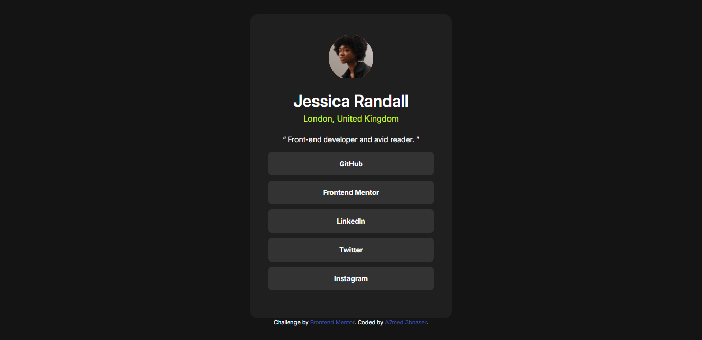

# Frontend Mentor - Social links profile

This is a solution to the [Social links profile challenge on Frontend Mentor](https://www.frontendmentor.io/challenges/social-links-profile-UG32l9m6dQ). Frontend Mentor challenges help you improve your coding skills by building realistic projects. 

## Table of contents

- [Overview](#overview)
  - [The challenge](#the-challenge)
  - [Screenshot](#screenshot)
  - [Links](#links)
  - [Built with](#built-with)
  - [What I learned](#what-i-learned)
  - [Author](#author)

## Overview

##### Second challenge
Social links profile card with hover and focus states and mobile responsive 

### The challenge

Users should be able to:

- See hover and focus states for all interactive elements on the page

### Screenshot

### Links

- Solution URL: [Add solution URL here](https://your-solution-url.com)
- Live Site URL: [Add live site URL here](https://your-live-site-url.com)

### Built with

- HTML
- CSS
- flexbox

### What I learned

practiced flexbox and mediaquery

## Author

- Frontend Mentor - [@AbdElnasser77](https://www.frontendmentor.io/profile/AbdElnasser77)
- Linkedin - [@Ahmed AbdElnasser](https://www.linkedin.com/in/ahmed-abdelnasser-484159241/)
